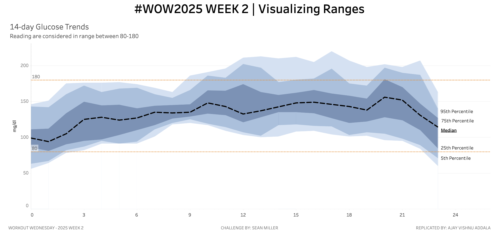

# WOW2025 | Week 2 | Visualizing Ranges

This repository contains my submission for **Workout Wednesday 2025 | Week 2 | Visualizing Ranges**. The challenge was to recreate an interesting visualization involving percentile ranges, median values, and reference bands in Tableau. Below are the details of the project.

---

## 📊 Dashboard Overview

The Tableau dashboard visualizes hourly data ranges with the following features:
- **Percentile Ranges**:
  - 5th Percentile
  - 25th Percentile
  - 75th Percentile
  - 95th Percentile
- **Median Level**: Shown as a dashed line.
- **Normal Range Reference**: A dotted band indicating the range of 80 to 180.
- **Layered Shading**: For visual emphasis on the percentile ranges.

---

## 🛠 Requirements

### Challenge Criteria:
- Dashboard size: **1300x600**.
- Created on a single sheet in Tableau.
- Properly layered and shaded percentile ranges.
- Reference band for "normal" range with dotted lines.

### Tools Used:
- **Tableau Public** for dashboard creation.
- Dataset containing hourly measurements.

### **Tableau Dashboard**
The interactive Tableau dashboard is published on Tableau Public. You can view it here:  

